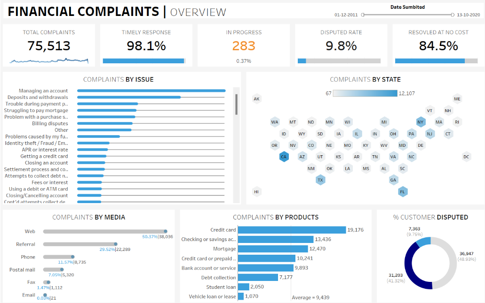

# 📊 Financial Complaints Dashboard

## 🧐 Overview
This project presents an interactive dashboard created using **Tableau** to visualize and analyze the dataset of **financial consumer complaints**. The dashboard provides a comprehensive overview of complaints filed, categorized by issue, media of submission, products/services, and states. It offers valuable insights for stakeholders in the banking industry to better understand complaint patterns and improve customer service.

## Dashboard


## ✨ Features

- **📈 Total Complaints**: Displays the total number of complaints (75,513).
- **⏱️ Timely Response**: Shows the percentage of complaints that were responded to within the specified time (98.1%).
- **🛑 Pending Complaints**: Visualizes the number of complaints still pending (0.37% of the total).
- **💸 Resolution at No Cost**: Shows the percentage of cases resolved without any monetary relief (84.5%).
- **📝 Complaint Distribution**:
  - **By Issue**: Categorizes complaints based on the nature of the issue (e.g., Managing an Account, Deposits and Withdrawals).
  - **By Media**: Shows the distribution of complaints by submission medium (Web, Referral, Postal Mail, etc.).
  - **By Product**: Breaks down complaints by product type (e.g., Credit Card, Checking/Savings Account, Mortgage).
  - **By State**: A Hex Map that visually represents complaints by state, with darker shades indicating higher complaint volumes.
- **⚖️ Customer Dispute**: A pie chart showing the percentage of customer disputes (9.75% of total complaints).

## 📊 Data Insights

- **🔝 Top Complaints by Issue**:
  - **Managing an Account**: The most common complaint issue.
  - **Deposits & Withdrawals**: A significant number of complaints regarding financial transactions.
  
- **📧 Complaints by Media**:
  - **Web**: 50.37% of complaints were submitted online via websites, portals, and apps.
  - **Referral**: 29.52% of complaints were referred via third parties.

- **💳 Top Products**:
  - **Credit Cards**: The most complained-about product, with 19,176 complaints (25.36%).
  - **Checking or Savings Accounts**: The second-highest, with 13,436 complaints (17.79%).
  - **Mortgages**: Third, with 12,470 complaints (16.51%).

- **🛑 Customer Disputes**: 40% of the complaints (31,203 complaints) were related to customer disputes.

- **🌍 State-Wise Complaints**: A Hex Map was used to display complaints by state, with darker shades representing states with higher complaints.

## ⚙️ Installation and Setup

1. **Clone the repository**:
   ```bash
   git clone https://github.com/yourusername/financial-complaints-dashboard.git